Docker官网 ： https://www.docker.com/

Docker源码 ：https://github.com/moby/moby

[Docker在sourcegraph上的阅读地址](https://sourcegraph.com/github.com/moby/moby)

Docker团队Git： https://github.com/docker

[深入浅出作者NigelPoulton的Github](https://github.com/nigelpoulton)

#### 1 、Docker能干什么

​		Docker是一个开源的应用容器引擎。

​		Docker的主要目标是**“Build,Ship and Run Any App,Anywhere”**.

​		就是通过对应用组件的封装、分发、部署、运行等生命周期的管理，是用户的APP及其运行环境能够做到“一次封装，到处运行”。

​		其核心是有Docker image（Docker 镜像）来支撑的。Docker通过**把应用的运行时环境和应用打包在一起，解决了部署环境依赖的问题**；通过引入**分层文件系统**的概念，**解决了空间利用的问题**。它彻底消除了编译、打包与部署、运维之间的鸿沟，与现在互联网企业推崇的DevOps理念不谋而合，大大提高了应用开发部署的效率。


##### 			   Docker可以解决哪些痛点：

###### 		1、开发人员

​			Docker化的应用都运行在独立的虚拟化环境中，天然具有隔离性，不用担心一机多用造成的管理混乱。

​			开发人员在多任务开发时，可以并行运行这些应用的Docker容器，每一个Docker应用有一个独立的运行环境，互不干扰。

​			开发机器硬件故障，在新开发机器上，重新从Docker仓库下拉开发环境的镜像，一两分钟内就可以重新搭建一套开发环境，并且即便新旧开发硬件和操作系统不一样，重新搭建的开发环境仍能保持和原来的环境一模一样，另外还可以通过Docker把重要变更及时备份到远端。

​			Docker的每个复杂软件都可以制作成Docker镜像，分享给大家。

###### 		2、测试人员

​			Docker不需要做任何配置，就能保证开发和测试环境完全一致，测试人员只需要关注测绘本身就可以了。

###### 		3、运维人员

​			服务具备快速部署能力，扩缩容、版本回退在几秒钟内就可以完成。

​			基于同一个Docker镜像部署服务，可以保证每台机器应用完全一致。

​			由于Docker应用是虚拟化，多个应用可以混合部署在一台机器上，互不干扰，可以提高机器使用率。

​			Docker的应用可以运行在不同硬件和操作系统平台下，在不同的环境自由迁移。

​			通过Dockerfile管理Docker镜像，即使系统多次易手、交接文档不全，运维人员也可以快速了解系统是如何搭建的。

​			Docker倡导“Build once，Run anywhere”，再烦琐的活儿，只需要做一次，制作成镜像，在任何环境下都可以运行；还可以基于这个镜像做修改，制作新的镜像。

#### 2、Docker的基本组成

|    组成    | 概念 |
| :--------: | :--: |
|   Image    | 镜像 |
| Container  | 容器 |
| Repository | 仓库 |

​		仓库中的应用都是以镜像的形式存在的，把镜像从Docker仓库下拉到本机，以这个镜像为模板启动应用，就叫容器。

###### 		Docker的组织结构

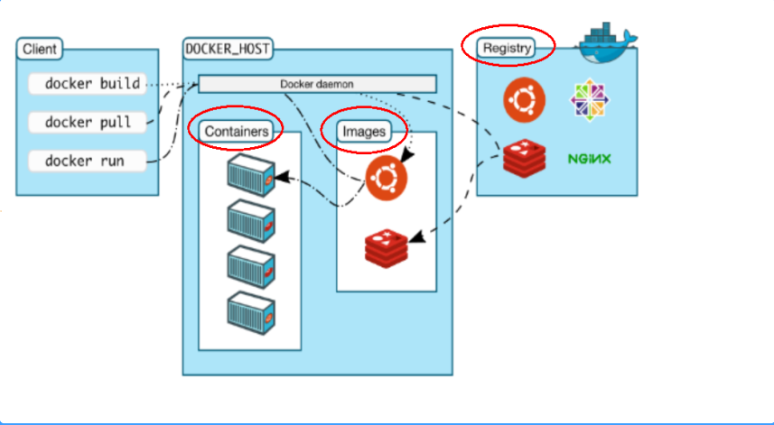


​				Docker位于操作系统和虚拟容器（lxc或libcontainer）之上，它会通过cgroup、namespaces和lincontainer等系统层面的接口完成资源分配或相互隔离。

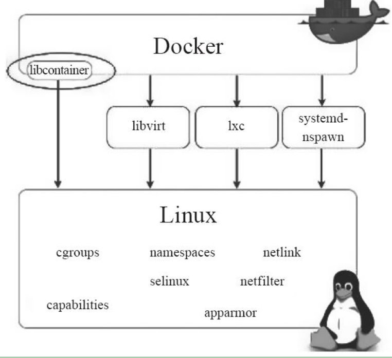

#### 3、关于容器技术

​		容器技术，又称为容器虚拟化，是一种操作系统虚拟化，是一种轻量级的虚拟化技术 。

​		**容器=cgroup+namespace+rootfs+容器引擎（用户态工具）**

​					其中各项的功能分别为：		

​					·Cgroup：资源控制。
​					·Namespace：访问隔离。
​					·rootfs：文件系统隔离。
​					·容器引擎：生命周期控制

​		容器的核心技术主要包括**Namespace**和**Cgroup**这2个内核特性。

##### 		3.1	**Namespace（命名空间**）: 

​				主要做**访问隔离**。其原理是针对一类资源进行抽象，并将其封装在一起提供给一个容器使用，对于这类资源，因为每个容器都有自己的抽象，而它们彼此之间是不可见的，所以就可以做到访问隔离。

​				3.1.1	Namespace主要是通过clone、setns和unshare这3个系统调用来完成的。

​				**clone**可以用来创建新的Namespace。

​				**unshare**为已有的进程创建新的Namespace。

​				**setns**可以将进程放到已有的Namespace。

```
docker exec 命令的实现原理就是setns。
```

​				3.1.2	 目前Linux内核总共实现了6种Namespace：

```
·IPC：隔离System V IPC和POSIX消息队列。
·Network：隔离网络资源。
·Mount：隔离文件系统挂载点。
·PID：隔离进程ID。
·UTS：隔离主机名和域名。
·User：隔离用户ID和组ID
```

###### 					3.1.2.1	**UTS Namespace 隔离主机名和域名**

​											为什么要使用UTS Namespace做隔离？

​											这是因为主机名可以用来代替IP地址，因此，也就可以使用主机名在网络上访问某台									机器了，如果不做隔离，这个机制在容器里就会出问题。

###### 					3.1.2.2 	**IPC是Inter-Process Communication的简写，也就是进程间通信**

​											IPC机制会用到**标识符**，两个进程通过标识符找到对应的消息队列进行通信等。

​											IPC Namespace 能做到的事情是，使相同标识符在2个Namespace中代表不通的消									息队列，这样也就使得2个Namespace中的进程不能通过IPC进程通信了。

###### 					3.1.2.3	**PID Namespace用于进程隔离PID号**

​											这样不同Namespace里的进程PID就可以是一样的。

###### 					3.1.2.4	**Mount Namespace用来隔离文件系统挂载点**

​											在创建了一个新的Mount Namespace后，进程系统对文件系统挂载/卸载的动作就不会									影响到其他Namespace。

###### 					**3.1.2.5	Network Namespace 对网络相关的系统资源进行隔离**

​											每个Network Namespace都有自己的网络设备、IP地址、路由表、/proc/net目录、端									口号等。

​											新建的Network Namespace会有一个lookback设备，用户需要在这里做自己的网络配									置。

###### 					3.1.2.6	**User Namespace用来隔离用户和组ID**

​											一个进程在Namespace里的用户和组ID可以与它在host里的ID不一样。

​											**User Namespace最有用的地方在于，host的普通用户进程在容器里可以是0号用户，**									**也就是root用户。**

##### 		3.2	**Cgroup（控制组）**: 

​				主要做**资源控制**。**用于限制和隔离一组进程对系统资源的使用**。其原理是将一组进程放在一个控制组		里，通过给这个控制组分配指定的可用资源，达到控制这一组进程可用资源的目的。

​				对实际资源的分配和管理是由各个Cgroup子系统完成的：

###### 				3.2.1	cpuset子系统

​						 	cpuset可以为一组进程分配指定的CPU和内存节点。

###### 				3.2.2	cpu子系统

​							cpu子系统用于限制进程的CPU占用率。

###### 				3.2.3	cpuacct子系统

​							cpuacct子系统用来统计各个Cgroup的CPU使用情况。

###### 				3.2.4	memory子系统

​							memoryzixt用来显示Cgroup所能使用的内存上限。

###### 				3.2.5	blkio子系统

​							blkiozxt用来限制Cgroup的block I/O带宽。

###### 				3.2.6	devices子系统

​							devices子系统用来控制Cgroup的进程对哪些设备有访问权限。

##### 3.3	查看容器信息

```shell
# 	docker inspcet以JSON的格式展示非常丰富的信息
docker inspect [OPTIONS] CONTAINER|IMAGE [CONTAINER|IMAGE...]
```

​	通过“-f”可以使用Golang的模板来提取指定部分的信息

```shell
# 提取容器的运行状态
$ docker inspect -f {{.State.Status}} MyWordPress
running
```

```shell
# 提取容器的IP地址：
$ docker inspect -f {{.NetworkSettings.IPAddress}} MyWordPress
172.17.0.5
```

```shell
# 查询日志。
docker logs CONTAINER
```


#### 4 、[Docker镜像](https://docs.docker.com/engine/reference/commandline/image/)

​			镜像：一种轻量级、可执行的独立软件包，用来打包软件运行环境和基于运行环境开发的软件，它包含运行某个软件所需的所有内容，包括代码、运行时、库、环境变量和配置文件。	

​			Docker是一个开源的容器引擎相当于Android系统，[Docker仓库](https://hub.docker.com/ )相当于APPstore应用市场，镜像（image）相当于APP, 可以运行在任何装有Docker引擎的操作系统上。

##### 4.1	联合文件系统（Union filesystem）

​			UnionFS 是Docker镜像的基础，它将各层文件系统叠加在一起，在用户看来就像一个完整的文件系统。

​			Docker镜像的最底层是bootfs（boot file system），boots主要包括bootloader和kernel。

​			rootfs（root file system）在bootfs之上，包含典型Linux系统的/dev,/proc,/bin,/etc等标准目录和文件。

rootfs就是各种不同的操作系统发行版，如Ubnutu，Centos等.

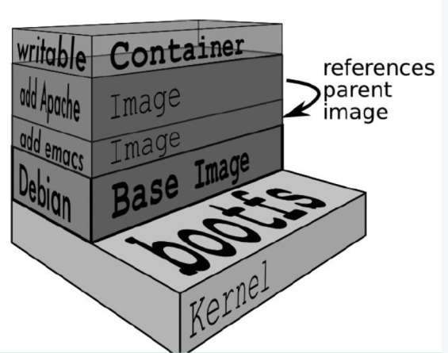

​			Docker镜像分层特点：**1、已有的分层只能读不能修改，2、上层镜像的优先级高于底层镜像。**

​			分层的好处：**共享资源**

​			比如：有多个镜像都从相同的 base 镜像构建而来，那么宿主机只需在磁盘上保存一份base镜像，

```shell
# 提交生成新镜像
docker commit
# 查看镜像分了多少层，每一层做了什么操作
docker history
```

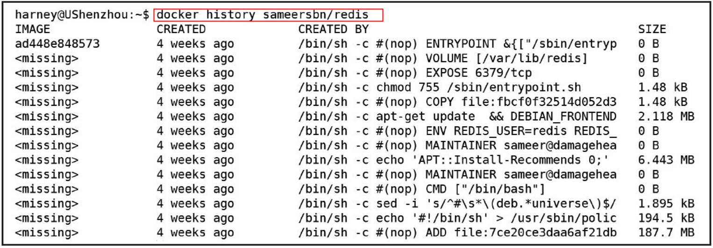

##### 			4.2	列出本机的镜像

```shell
docker images # 列出本地主机上的镜像
	OPTIONS说明：  -a：列出本地所有的镜像
				  -q：只显示镜像ID
				  --digests：显示镜像的摘要信息
				  --no-trunc：显示完整的镜像信息
				  --filter"dangling=true"：显示所有“悬挂”镜像，即没有对应名称和tag的镜像
```

##### 			4.3	创建一个镜像

```shell
docker pull  # 从镜像仓库下载镜像

docker load  # 一般只导入有docker save导出的镜像。导入后的镜像跟原镜像完全一样，包括镜像ID和分层等内容

docker import # 用于导入包含根文件系统的归档，并将之编程Docker镜像，常用来制作Docker基础镜像。
docker export # 把一个镜像导出为根文件系统的归档。

docker build  # 通过Dockerfile文件生成镜像
```

##### 		4.4	搜索镜像

```shell
# 网站 https://hub.docker.com
docker search 
```

##### 		4.5	删除镜像

```shell
docker rmi -f 镜像ID
docker rmi -f $(docker images -qa) # 删除全部镜像
```

##### 		4.6	Docker 镜像生命周期

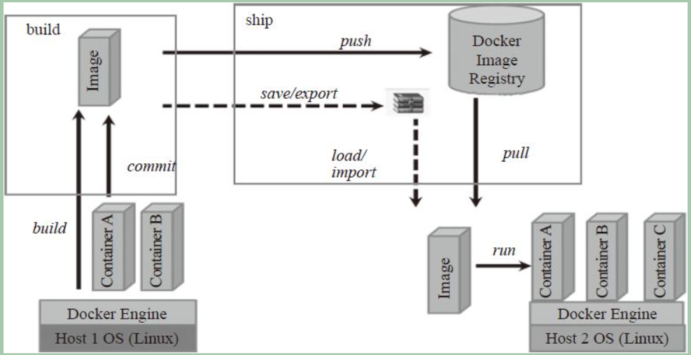


#### 5、Docker 仓库

​		仓库（repository）用来集中存储Docker镜像，支持镜像分发和更新。

​		**Docker不仅具有版本控制功能，并且还能够利用分层特性做到增量更新。**

​		5.1	Docker官方的公共仓库 https://hub.docker.com/ ，类似Github托管代码。

​		5.2	[Docker Registry](https://docs.docker.com/registry/)是构建仓库的核心，用于实现开源Docker镜像的分发.

​				  Docker Registry源码：https://github.com/docker/distribution

​				 [Docker registry Command](https://docs.docker.com/engine/reference/commandline/registry/)

​		5.3	构建私有仓库

```shell
# 拉取镜像
docker run -p 5000:5000 registry
# 查看端口 打开浏览器输入http://{ip_add}:5000/v2/查看
netstat -ltnp|grep 5000
```

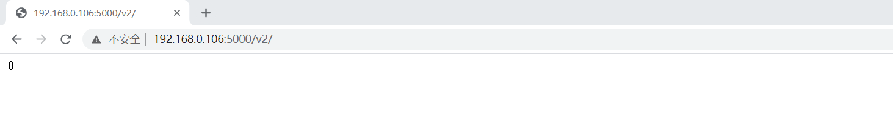

#### 6、[Docker网络](https://docs.docker.com/network/)

​		[docker network 命令](https://docs.docker.com/engine/reference/commandline/network/)

##### 		6.1	Docker的通信方式

​				  默认情况下，Docker使用网桥(bridge)+NAT的通信模型。

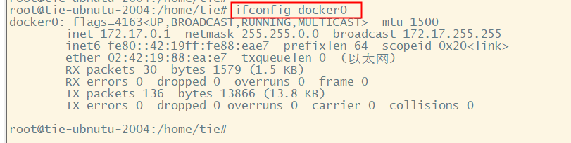

​		当Docker启动容器时，会创建一对veth虚拟网络设备，并将其中一个veth网络设备附加到网桥docker0，另一个加入容器的网络名字空间（network namespace），并改名为eth0。这样，同一个host的容器与容器之间就可以通过docker0通信了。

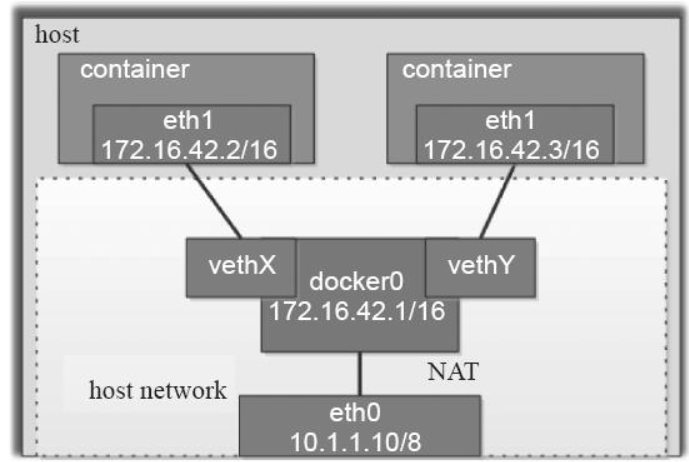

##### 		6.2	容器网路模型

​				 Libnetwork项目提供了**容器网路模型（Container Network Model ，简称CNM）**,定义了标准的API用于为容器配置网络，其底层可以适配各种网络驱动。CNM有三个重要概念：

​		1、**沙盒**。沙盒是一个隔离的网络运行环境，保存了容器网络栈的配置，包括了对网络接口、路由表和DNS配置的管理。在Linux平台上，沙盒是用Linux Network Namespace实现的，在其他平台上可能是不同的概念，如FreeBSD Jail。一个沙盒可以包括来自多个网络的多个Endpoint（端点）。

​		2、**Endpoint**。Endpoint将沙盒加入一个网络，Endpoint的实现可以是一对veth pair或者OVS内部端口，当前的Libnetwork使用的是veth pair。一个Endpoint只能隶属于一个沙盒及一个网络。通过给沙盒增加多个Endpoint可以将一个沙盒加入多个网络。
​		3、**网络**。网络包括一组能互相通信的Endpoint。网络的实现可以是Linux bridge、vlan等。


Libnetwork实现了五种驱动（driver）：

| 驱动    |                             特征                             |
| ------- | :----------------------------------------------------------: |
| bridge  |                   Docker默认的容器网路驱动                   |
| host    | 容器与主机共享同一Network Namespace，共享同一套网络协议栈、路由、iptables等 |
| null    |       容器内网络配置为空，需要手动配置网络接口和路由等       |
| remote  |                    Docker网络插件的实现。                    |
| overlay |              Docker原生的跨主机多子网网络方案。              |

```shell
docker network ls  # 查看local的网络信息
```

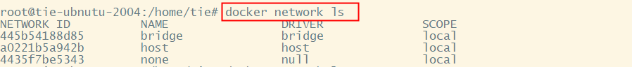

```shell
# 获取网络信息的元数据
docker network inspect [OPTIONS] NETWORK [NETWORK...]
```

```powershell
root@tie-ubnutu-2004:/home/tie# docker network inspect -v 445b54188d85
[
    {
        "Name": "bridge",
        "Id": "445b54188d853266dea9a6b1e3a389d4d230b0f7fb561c7620001ce3c6e6b5cf",
        "Created": "2020-11-30T21:41:04.218315623+08:00",
        "Scope": "local",
        "Driver": "bridge",
        "EnableIPv6": false,
        "IPAM": {
            "Driver": "default",
            "Options": null,
            "Config": [
                {
                    "Subnet": "172.17.0.0/16",
                    "Gateway": "172.17.0.1"
                }
            ]
        },
        "Internal": false,
        "Attachable": false,
        "Ingress": false,
        "ConfigFrom": {
            "Network": ""
        },
        "ConfigOnly": false,
        "Containers": {
            "08e4ddf1f65689bcdaa4e11c127ece7f330c3a296c98e42dc97b32353026ec06": {
                "Name": "affectionate_wozniak",
                "EndpointID": "03a8ce1cfde575ac4614eb1eac1ee964254cd88adace450734708408f6de7304",
                "MacAddress": "02:42:ac:11:00:03",
                "IPv4Address": "172.17.0.3/16",
                "IPv6Address": ""
            },
            "bf422e69de710f3b21aca5be6ba6740620c2a9b818ee8be74a2429292b7901e4": {
                "Name": "db",
                "EndpointID": "0f2a16dc2294cb5b91b918d7f754c2f51618255c370d822c8bcacfc89396a35c",
                "MacAddress": "02:42:ac:11:00:02",
                "IPv4Address": "172.17.0.2/16",
                "IPv6Address": ""
            }
        },
        "Options": {
            "com.docker.network.bridge.default_bridge": "true",
            "com.docker.network.bridge.enable_icc": "true",
            "com.docker.network.bridge.enable_ip_masquerade": "true",
            "com.docker.network.bridge.host_binding_ipv4": "0.0.0.0",
            "com.docker.network.bridge.name": "docker0",
            "com.docker.network.driver.mtu": "1500"
        },
        "Labels": {}
    }
]
```


#### 7、[数据卷](https://docs.docker.com/storage/volumes/)

​     	Docker容器里产生的数据，如果不通过docker commit生成新的镜像， 使数据作为镜像的一部分保存下来，就会在容器删除后丢失。为了能够**持久化保存和共享容器的数据**，Docker提出了卷（volume）的概念。

```shell
docker run -it -v /宿主机目录:/容器内目录 镜像名
docker run -it -v /宿主机目录:/容器内目录:ro 镜像名 # 以只读的方式挂载一个数据卷
docker inspect 镜像名  # 查看数卷是否挂载成功
```

##### 		7.1	**创建数据卷容器： --volume-from 容器之之间共享**

```shell
# 要创建多个Postgres数据库，并且希望这些数据库之间共享数据，可以先创建一个数据卷容器
docker create -v /dbdata --name dbdata training/postgres /bin/true

# 启动Postgres数据库服务，使用--volumes-from参数将上面生成的数据卷挂载进来，之后启动多个容器，各个容器# 之间就可以通过dbdata数据卷共享数据了：
docker run -d --volumes-from dbdata --name db1 training/postgres
docker run -d --volumes-from dbdata --name db2 training/postgre

#	可以使用--volume-from db1或--volume-from db2的方式挂载dbdata数据卷
docker run -d --name db3 --volumes-from db1 training/postgres
```

​		**数据卷的生命周期一直持续到没有容器使用它为止**

​		使用数据卷容器存储的数据不会轻易丢失，

​		即便删除db1、db2容器甚至是初始化该数据卷的dbdata容器，该数据卷也不会被删除。

​		只有在删除最后一个使用该数据卷的容器时显式地指定docker rm–v$CONTAINER才会删除该数据卷。

##### 	7.2	备份恢复数据卷

```shell
# 备份
docker run --volumes-from dbdata -v $(pwd):/backup ubuntu tar cvf /backup/backup.tar /dbdata

# 恢复到新容器
docker run --volumes-from dbdata2 -v $(pwd):backup busybox tar xvf /back/backup.tar 
```

##### 	7.3	Docker卷管理的问题

​				1）**只支持本地数据卷。**Docker没有办法把远程服务器的数据卷挂载到本机，

​					  对此 Docker引入了卷插件机制，允许使用者以**第三方插件**的形式，提供对分布式存储的支持。

​				2）**缺乏对数据卷生命周期的有效管理**。Docker没有办法对数据卷进行系统管理。

​					 例如 1、无法使用Docker命令查看当前系统的所有数据卷。

​							  2、只有使用docker rm删除最后一个使用数据卷的容器时显式的加上-v参数，才能删除数据卷，否则数据卷永不会被删除，并且Docker将再也无法管理该数据卷。久而久之这些悬挂数据卷浪费大量的空间。

##### 	7.4	卷插件

​				**工作原理**：社区定义了一套**标准的卷插件REST API**，Docker自身实现了这套API的客户端，它会按照步骤发现、激活插件。当Docker需要创建、挂载、卸载、删除数据卷时，它会向插件发送对应的REST API，由插件来真正完成创建数据卷等工作，这就是卷插件的基本原理。


​		**已有的卷插件**:

​				**·Convoy**：一种基于本地存储的单机版插件，本地支持的存储驱动包括Device Mapper、VFS、EBS等（可将NFS挂载到VFS目录下，实现跨主机存储和共享）。Convoy具有存储备份功能，可以为卷名称设置还原点，并基于还原点恢复数据。由于Convoy是个单机版插件，因此对卷的迁移和共享支持得不是很好。

​				**·Flocker**：另外一个功能很强大的卷插件，支持多种后台存储驱动，包括OpenStack Cinder、AWS EBS、EMC ScaleIO、ZFS等。虽然Flocker支持卷的迁移，但不支持卷共享。


#### 8、[Docker API](https://docs.docker.com/engine/api/)

**Docker API种类**
目前Docker提供如下三类RESTful API：
**·Docker Remote API**：诸如docker run等操作最终均是通过调用Docker Remote API向Docker daemon发起请求的。

**·Docker Registry API**：与镜像存储有关的操作可通过Docker Registry API来完成。

·**Docker Hub API**：用户管理等操作可通过Docker Hub API来完成。


#### 9、[Docker 安全](https://docs.docker.com/engine/security/)

##### 	9.1.1	Docker的安全性

​				 Docker的安全性主要体现在如下几个方面：

​				 1、**Docker容器的安全性：容器是否会威海到host或其他容器**。

​				 2、镜像的安全性：用户如何确保下载的镜像是可信的、未被篡改过的。

​				 3、Docker daemon的安全性：如何确保发送给daemon的命令是由可信用户发起的。

##### 	9.1.2	Docker容器的安全性

​				 **容器安全性问题的根源在于，容器和host共用内核**，没有人能信心满满的地说不可能由容器入侵到host。共用内核的另一个问题是，如果某个容器里的应用导致Linux内核崩溃，那么整个系统都会崩溃。

##### 	9.2 安全策略

###### 			9.2.1 Cgroup

​						Cgroup用于限制容器对CPU、内存等关键资源的使用，防止某个容器由于过度使用资源，导致host或其他容器无法正常运行。

###### 			9.2.2	ulimit

​						Linux系统有一个ulimit指令，可以对一些类型的资源起到限制作用，包括core dump文件的大小，进程数据段的大小，可创建文件的大小，打开文件的数量，CPU时间，单个用户的最大线程数等。

​						Docker 可以设置全局默认的ulimit，例如

```shell
# 设置CPU时间
sudo docker daemon --defalut-ulimit cpu=1200
# 在启动容器时，单独对其ulimit进行设置
docker run --rm -it --ulimit cpu=1200 ubnutu bash
```

###### 		9.2.3	容器组网

​					在接入容器隔离不足的情况下，将受信任和不受信任的容器组网在不同的网络中，可以减少危险。

###### 		9.2.4	容器+全虚拟化

​					如果将容器运行在全虚拟化环境中（例如在虚拟机中运行容器），这样就算容器被攻破。也还有虚拟机的保护作用。目前一些安全需求很高的应用场景采用的就是这种方式，比如公有云场景。

###### 		9.2.5	镜像签名

​					Docker可信镜像及升级架构（The Update Framework ，TUF）使得我们可以检验镜像的发布者。

​					当发布者将镜像push到远程的仓库时，Docker会对镜像用私钥进行签名，之后有其他人pull这个镜像的时候，Docker就会用发布者的公钥来校验该镜像是否个发布者所发布的镜像一致，是否被篡改过，是否是最新版。

###### 		9.2.6	日志审计

​					 Docker支持日志驱动，使得用户可以将日志直接从容器输出到如syslogd这样的日志系统，

​					 通过docker --help可以看到Docker daemon支持log-driver，目前支持的类型有none、json-file、syslog、gelf和fluentd，默认的是json-file。


```shell
# 对单个容器是定驱动
docker run -it -rm --log-driver="syslog" ubnutu bash
```

###### 		9.2.7	监控		

```shell
# 查看容器的运行状态（如running、exited、dead等）
docker ps -a
```


**Docker提供了stats命令来实时监控一个容器的资源使用**


###### 		9.2.8	文件保护系统

​					 Docker可以设置容器的根文件系统为只读模式，只读模式的好处是，即使容器与host使用的是同一个文件系统，也不用担心会影响甚至破坏host的根文件系统。但这里需要注意的是，必须把容器里进程remount文件系统的能力给禁止掉，否则在容器内又可以把文件系统重新挂载为可写。甚至更进一步，用户可以禁止容器挂载任何文件系统。				

```shell
# 示例一：可读写挂载。
$ docker run -ti --rm ubuntu bash            
root@4cdf0b0d62ca:/# echo "hello" > /home/test.txt
root@4cdf0b0d62ca:/# cat /home/test.txt hello
# 示例二：只读挂载。
$ docker run -ti --rm --read-only ubuntu bash
root@a2da6c14ccd4:/#  echo "hello" > /home/test.txt
bash: /home/test.txt: Read-only file syste
```


##### 9.3	安全加固

###### 			9.3.1	主机逃逸 

​						主机逃逸实为虚拟机逃逸，主要指利用虚拟软件或虚拟机中运行的软件的漏洞进行攻击，已达到攻击或控制虚拟机宿主机操作系统的目的。

​						[shocker]( https://github.com/gabrtv/shocker.git)攻击就是容器影响host的一个例子。

​						shocker攻击的核心是利用了一个不常见的系统调用：open_by_handle_at。

###### 			9.3.2	安全加固之capability

​						Shocker关键是执行了系统调用open_by_handle_at，这个系统调用需要用到dac_read_search这个			capability，如果去掉这个capability，攻击自然就不奏效了.

```shell
docker run --rm -ti --cap-add=all --cap-drop=dac_read_search shocker bash 
docker run --rm -ti shocker bash
```

​					从capability的使用可以知道，赋予给容器的能力越小，就相对越安全，也就是通常所说的赋予容器必需的最小能力。所以**在启动容器时，强烈建议不要使用--privileged，并且要将不需要的能力尽量都去掉。**

###### 			9.3.3	安全加固之SELinux

​						目前SELinux是效果最好的Docker安全加固手段，

​						若用户的使用环境支持SELinux，**强烈建议用户打开SELinux功能**。

```shell
# 在启动Docker daemon时打开SELinux。
sudo docker daemon --selinux-enabled=true
# 运行Shocker
docker run --rm -ti --cap-add=all shocker bash
```

###### 			9.3.4	[安全加固之AppArmor](https://docs.docker.com/engine/security/apparmor/)


#### 10、[Libcontainer](https://github.com/docker-archive/libcontainer)

​			**[Docker 中Libcontainer源码](https://github.com/moby/moby/tree/master/vendor/github.com/opencontainers/runc/libcontainer)**

​			Libcontainer作为Docker底层的容器引擎，实现了Docker对容器的最核心需求。Docker所有对容器生命周期进行管理的操作都是通过调用Lincontainer的API来实现的。Docker是建立在引擎之上，更高层面、功能更强大的容器管理工具。

​			Libcontainer作为一个独立的开源项目，跟Docker的耦合性很低。

##### 			Libcontainer的功能：

​					1、运行容器

​					2、暂停/恢复容器

​					3、销毁容器

​					4、向容器发送信号

​					5、获取容器的信息（ID、进程、状态、配置等）

​					6、修改容器配置

​					7、Checkpoint/Restore容器

容器启动过程


#### 11、[Dockerfile](https://docs.docker.com/engine/reference/builder/)

​		[Dockerfile practices](https://docs.docker.com/develop/develop-images/dockerfile_best-practices/)

​		Dockerfile是用来构建Docker镜像的文件，是由一系列命令和参数构成的脚本。

​		Dockerfile的注释都是以“#”开始的，每一行是一个指令。

​		一般情况下，Dockerfile由4部分组成：基础镜像信息、维护者信息、镜像操作指令和容器启动指令。

​		**Dockerfile的第一条有效信息（注释除外）必须是基础镜像信息，维护者信息紧随其后。最后是镜像启动指令。**

​		Dockerfile常用指令：

| 指令       | 格式                                                         | 说明                                                         |
| :--------- | :----------------------------------------------------------- | :----------------------------------------------------------- |
| FROM       | FROM<image>:<tag>                                            | Dockerfile的第一条必须是FROM指令，用指定要制作的镜像继承自哪个镜像。    可以在Dockerfile中写多个FROM指令来构建复杂的镜像。 |
| MAINTAINER | MAINTAINER<name>                                             | 用来指定维护者信息                                           |
| RUN        | RUN<command>或                            RUN["executable","param1","param2"...] | 用来执行shell命令，当解析Dockerfile时，遇到RUN命令，Docker会将该指令翻译为 “/bin/bash-c” |
| EXPOSE     | EXPOSE <port>[<port>...]                                     | 用来将容器中的端口号暴露出来  也可以通过"docker run -p"实现与服务器端口的映射 |
| WORKDIR    | WORKDIR /path/to/workdir                                     | 指定在创建容器后，终端默认登录进来的工作目录                 |
| CMD        | 1、使用exec执行，推荐方式；CMD["executable","param1","param2"]                               2、在/bin/sh中执行，提供给需要交互的应用 ；                     CMD command param1 param2                                                 3、提供给ENTRYPOINT的默认参数； CMD["param1","param2"] | 指定启动容器时执行的命令。      1、每个Dockerfile只能有一条CMD指令。2、如果指定了多条CMD指令，只有最后一条会被执行。 3、 如果用户启动容器时指定了运行的命令，则会覆盖掉CMD指定的命令。 |
| ENTRTPOINT | ENTRYPOINT["executable","param1","param2"]     ENTRTPOINT command param1  param2(Shell中执行) | 每个Dockerfile只能有一个ENTRYPOINT,当有多个时，只有最后一个生效。 |
| VOLUMN     | VOLUMN["/data"]                                              | 创建一个可以从本地主机或其他容器挂载的挂载点，一般用来存放数据库或需要永久保存的数据。                            如果和host共享目录，Dockerfile中必须先创建一个挂载点，然后在启动容器的时候通过“docker run–v$HOSTPATH：$CONTAINERPATH”来挂载，其中CONTAINERPATH就是创建的挂载点。 |
| ENV        | ENV<key><value>                                              | 指定一个环境变量，会被后续RUN指令使用，并在容器运行时保持。  |
| ADD        | ADD<src><dest>                                               | 该指令将复制指定的<src>到容器的<dest>。其中<src>可以是Dockerfile所在目录的一个相对路径；也可以时一个URL;还可以时一个tar文件（自动解压为目录） |
| COPY       | COPY<src><dest>                                              | 复制本地主机的<src>（Dockerfile所在目录的相对路径）到容器的<dest>，当使用本地目录为源目录时，推荐使用COPY. |

```
Dockerfile文件
```

```shell
#This Dockerfile uses the busybox image 
# VERSION 1 - EDITION 1
# Author: tie
FROM  busybox:latest
RUN  date;sleep 100;date
RUN  echo "abc" > /mytest
RUN  date;sleep 100;date
CMD  /bin/sh
```


```shell
# build制作镜像
docker build -t busybox:v1 .
```

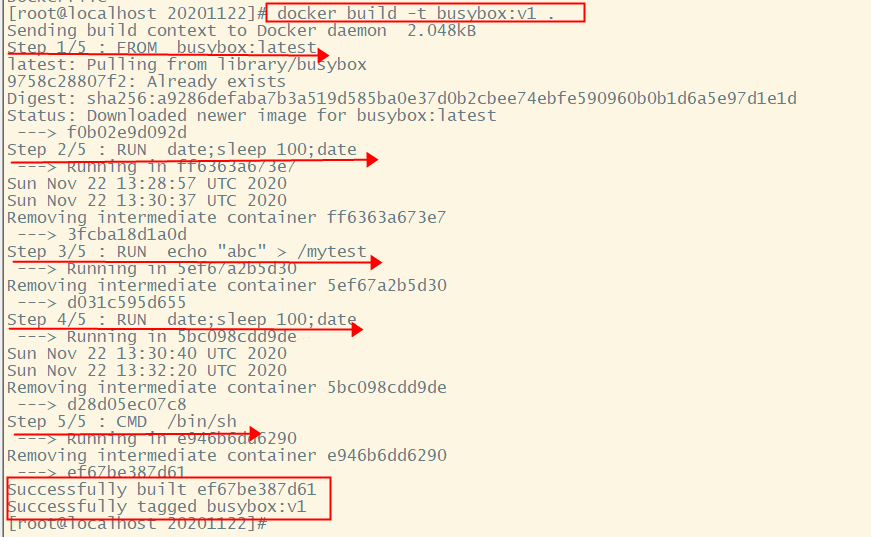

```
# 通过docker ps 查看docker正在做什么
```


```
查看docker 镜像
```


https://github.com/dockerfile   

​		Docker公司在Github上维护了一个Dockerfile项目 ,该项目为一些常见开源软件服务提供Dockerfile和自动构建方案,根据该工程中的各服务介绍和Dockerfile来快速开发、测试和部署新的应用程序

相关文档http://dockerfile.github.io/

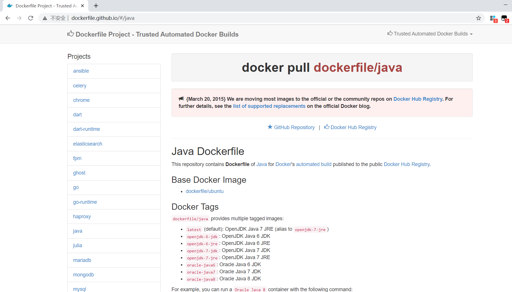


